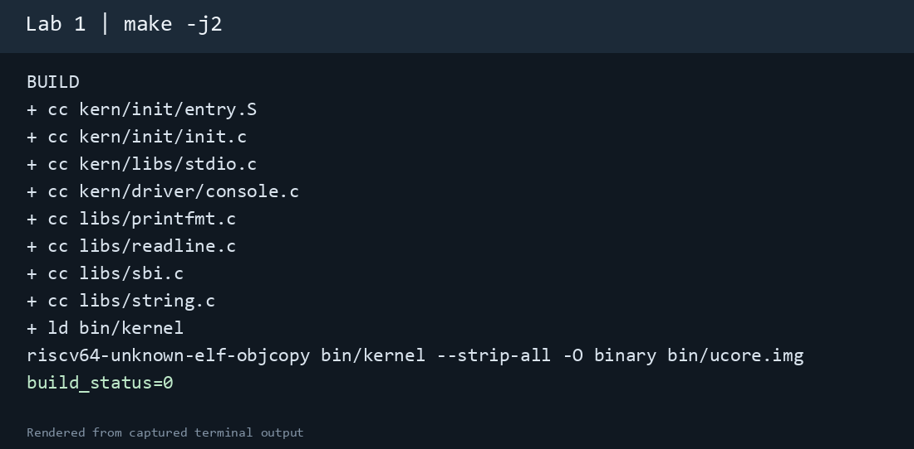
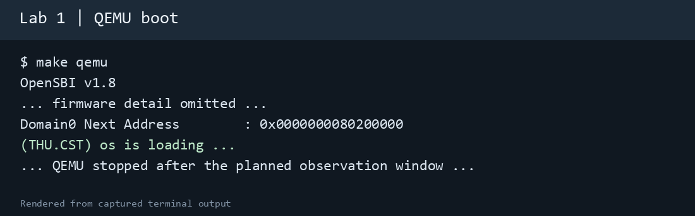
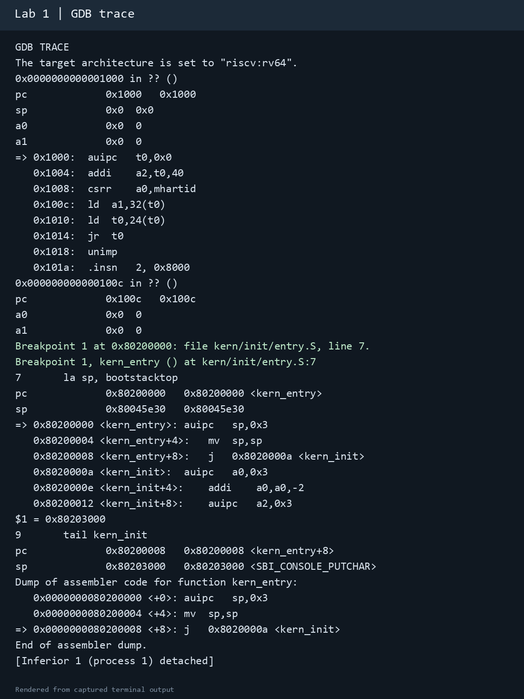

# 操作系统实验报告

## 实验基本信息

| 项目 | 内容 |
|---|---|
| 实验名称 | Lab 1：比麻雀更小的麻雀——最小可执行内核 |
| 小组成员 | 待填写：学号、姓名 |
| 完成日期 | 2026-10-08 |

### 小组分工

| 成员 | 负责的练习／模块 |
|---|---|
| 待填写：学号－姓名 | 待填写 |
| 待填写：学号－姓名 | 待填写 |
| 待填写：学号－姓名 | 待填写 |

## 一、实验目的

1. 理解 RISC-V 虚拟机从复位代码、OpenSBI 到内核入口的启动流程。
2. 理解链接脚本、内核镜像、入口汇编、内核栈及 SBI 控制台输出之间的关系。
3. 编译并运行 lab1 的最小内核，使用 GDB 观察实际的指令地址、栈指针和控制流。

## 二、实验环境

实验在 VMware 的 `os2026` 虚拟机中完成，客体系统为 Ubuntu 26.04.1 LTS，工程目录为 `/home/vmuser/lab1`。

| 工具 | 版本／用途 |
|---|---|
| GNU Make | 4.4.1，构建工程 |
| `riscv64-unknown-elf-gcc` | 14.2.0，交叉编译 RISC-V 64 位代码 |
| `qemu-system-riscv64` | 10.2.1，模拟 RISC-V `virt` 机器 |
| `gdb-multiarch` | 17.1，远程调试内核 |

按实验报告模板记录本次使用的 AI 工具；此处只涉及 **lab1** 的代码阅读、构建兼容处理和验证，不涉及其他实验内容。

| 成员 | AI 编程工具 | 底层模型 | 备注 |
|---|---|---|---|
| 本次实验操作 | Codex 桌面应用 | GPT-6 | 通过终端操作虚拟机，结果以 QEMU 和 GDB 实测为准 |
| 其他小组成员 | 待填写 | 待填写 | 按实际使用情况填写 |

## 三、实验整体逻辑分析

### 2.1 本章节的逻辑主线

lab1 以“内核怎样开始执行”为主线。源文件先经过交叉编译和链接，形成入口地址为 `0x80200000` 的 ELF 内核；再转换为供 QEMU 加载的二进制镜像。虚拟 CPU 从复位地址执行，经过 OpenSBI 初始化并进入 S 态内核。内核入口建立自己的栈，跳到 C 函数 `kern_init`，通过 SBI 控制台服务输出文字，最后停留在无限循环中。

### 2.2 功能的逐步实现

1. **编译与链接**：Makefile 调用交叉工具链；`tools/kernel.ld` 指定入口和各段地址。地址正确，固件才能转交控制权。
2. **镜像加载与固件交接**：QEMU 启动 OpenSBI 并加载内核镜像，OpenSBI 最终跳向 `0x80200000`。
3. **入口初始化**：`kern_entry` 设置栈指针，然后尾跳转至 `kern_init`，为 C 代码执行提供基础。
4. **控制台输出**：`kern_init` 清零 BSS 后调用 `cprintf`；字符经控制台驱动与 SBI `ecall` 输出。
5. **调试验证**：GDB 从 `0x1000` 观察复位指令，在 `0x80200000` 命中断点，并检查栈指针变化和跳转目标。

## 四、实验内容与实现

### 功能模块：最小内核的启动与输出

**负责人：**待填写。

#### 模块功能描述

本实验包已提供核心代码。本次未改动 C 函数或入口汇编的实现，而是阅读并验证其行为；为适配虚拟机中的 QEMU 和 GDB，只调整了 Makefile 的启动和调试命令。

**涉及的入口与函数：**

```c
/* kern/init/entry.S 中的汇编入口标签 */
/* kern_entry */
int kern_init(void) __attribute__((noreturn));
void sbi_console_putchar(unsigned char ch);
```

`tools/kernel.ld` 将 `kern_entry` 放在 `0x80200000`。入口汇编设定 `sp=bootstacktop` 后跳往 `kern_init`。`kern_init` 清零 `edata` 至 `end` 之间的 BSS，经 `cprintf` 输出提示，再进入无限循环。输出路径为 `cprintf` → `vcprintf`／`vprintfmt` → `cons_putc` → `sbi_console_putchar` → `sbi_call`／`ecall`。

#### 最终提示词

以下是针对 **lab1 构建兼容与启动验证**整理的可复用提示词；它不要求重写已提供的内核功能。

````markdown
[PROMPT]
检查 lab1 的 Makefile、链接脚本和入口代码。在实际工程中只修改必要的
启动与调试命令，使当前 QEMU 能从 0x80200000 执行内核，并能用已安装的
GDB 调试。保留已有 C 代码和汇编代码，展示修改差异和验证结果。

[RELY]
tools/kernel.ld 的 BASE_ADDRESS 为 0x80200000，ENTRY 为 kern_entry；
镜像是 bin/ucore.img；本机有 qemu-system-riscv64 和 gdb-multiarch。

[GUARANTEE]
make qemu 能输出“(THU.CST) os is loading ...”；
make debug 能暂停虚拟 CPU 供 GDB 连接；
make gdb 使用本机存在的调试器。

[SPECIFICATION]
保留内核原有输出和无限循环行为。验证时记录复位 PC、内核入口 PC、
执行入口指令前后的 SP，以及跳转至 kern_init 的位置。
````

#### 实现迭代过程

##### 第一次迭代：原 Makefile 的运行情况

原 `qemu` 目标使用 `-device loader,file=...,addr=0x80200000`。在本机 QEMU 10.2.1 上，OpenSBI 能启动，但其 `Domain0 Next Address` 为 `0x0`，未出现内核输出。说明镜像虽被放入内存，当前启动方式没有把内核入口正确交给 OpenSBI。

##### 第二次迭代：修改启动和调试目标

把 `qemu` 与 `debug` 目标改为 `-kernel $(UCOREIMG)`；把 `make gdb` 使用的调试器改为已安装的 `gdb-multiarch`。再次运行后，OpenSBI 报告的 `Domain0 Next Address` 为 `0x80200000`，内核提示出现，GDB 断点命中 `kern_entry`。所有改动均在 Makefile 中，内核源代码保持原样。

### 练习 1：理解内核启动中的程序入口操作

**负责人：**待填写。

`la sp, bootstacktop` 把标签 `bootstacktop` 的地址写入栈指针寄存器 `sp`，为内核建立自己的栈。此前 `sp` 仍是固件留下的值，不能当作内核 C 函数的可靠栈使用。本次 GDB 实测：到达 `kern_entry` 时 `sp=0x80045e30`；执行该伪指令展开的两条指令后，`sp=0x80203000`，与 `bootstacktop` 地址一致。

`tail kern_init` 不保存返回到 `kern_entry` 的调用路径，直接把控制流交给 `kern_init`。`kern_init` 声明为 `noreturn` 且最终进入无限循环，因而无需返回。反汇编显示跳转指令位于 `0x80200008`，目标 `kern_init` 位于 `0x8020000a`。

### 练习 2：使用 GDB 验证启动流程

**负责人：**待填写。

启动 QEMU 时使用 `-S` 在复位处暂停 CPU，使用 `-gdb tcp:127.0.0.1:1234` 开放调试端口。GDB 加载 `bin/kernel` 的符号，连接后反汇编当前 PC，单步执行几条复位指令，再在 `0x80200000` 下断点并继续。实测关键记录如下：

```text
连接后：pc = 0x1000，sp = 0x0
0x1000: auipc t0,0x0
0x1004: addi  a2,t0,40
0x1008: csrr  a0,mhartid
0x100c: ld    a1,32(t0)
0x1010: ld    t0,24(t0)
0x1014: jr    t0

Breakpoint 1, kern_entry at 0x80200000
入口前：sp = 0x80045e30
栈初始化后：sp = 0x80203000
0x80200008: j 0x8020000a <kern_init>
```

**答案：**最初执行的指令位于 `0x1000` 附近，是 QEMU 提供的复位 ROM 代码。它计算启动数据位置、读取硬件线程编号 `mhartid`、准备下一阶段入口和参数，然后跳向固件。OpenSBI 完成机器态初始化，将控制权交给位于 `0x80200000` 的内核入口。GDB 在该地址命中 `kern_entry`，直接证实了交接。

本次使用 `-kernel` 启动时，QEMU 在 CPU 运行前装入内核镜像。因此，指导书所建议的内存写监视点未必会在运行期触发；本次采用入口断点和 OpenSBI 报告的入口地址验证加载与跳转。

### Challenge

指导书的 lab1 部分没有列出额外 Challenge。

## 五、测试与验证

| 项目 | 实际结果 |
|---|---|
| `make -j2` | 成功生成 `bin/kernel` 和 `bin/ucore.img`；前者是 RISC-V 64 位 ELF |
| `make qemu` | OpenSBI 运行后输出 `(THU.CST) os is loading ...` |
| GDB 启动跟踪 | 复位 PC 为 `0x1000`；在 `0x80200000` 命中 `kern_entry`；栈指针变为 `0x80203000` |

以下图片根据 **本次真实终端输出日志排版生成**，保留了关键命令与输出；它们不是虚拟机桌面的直接屏幕截图。







`kern_init` 本身进入无限循环；测试时用超时命令结束 QEMU 进程，结束动作不表示内核启动失败。

## 六、实验总结与收获

### 对操作系统的理解

| 实验知识点 | 对应的 OS 原理及关系 |
|---|---|
| 交叉编译 | 宿主机运行 x86_64，目标机器执行 RISC-V 64 位指令；产物必须匹配目标架构与 ABI。 |
| 链接脚本和入口 | 链接地址、镜像加载地址与固件跳转目标必须相互匹配。 |
| 固件和特权级 | 复位 ROM、OpenSBI、S 态内核形成启动链；内核通过 SBI 请求固件服务。 |
| 内核栈 | 进入 C 代码之前先建立独立栈，支持函数调用和局部数据。 |
| 早期控制台 | `cprintf` 最终经 SBI 输出字符，为尚无完整驱动的内核提供调试手段。 |
| 远程调试 | QEMU 提供目标机器，GDB 观察真实寄存器与指令，以证据验证控制流。 |

页表和虚拟内存、中断与异常处理、进程调度、系统调用、文件系统、同步互斥都属于重要的 OS 原理，但 lab1 的最小内核尚未实现这些机制。

### AI 协作开发的经验

本次 lab1 中，构建工具修改先以 Makefile 和链接脚本的真实内容为依据，再用 QEMU 的 `Next Address`、内核输出和 GDB 断点逐项核实。单看“OpenSBI 已启动”不足以证明内核执行；必须观察到内核入口和输出。实验报告只记录实际执行并可复查的结果。
